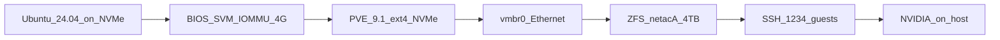
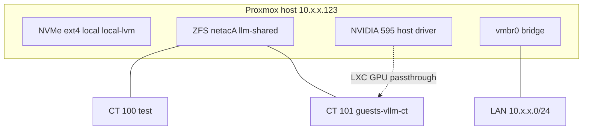

# Как мы подняли Proxmox VE 9.1 дома

*Инженерный дневник. Май 2026.*

Мы перевели домашний сервер с **Ubuntu 24.04** на **Proxmox VE 9.1**. Цель была простая и широкая: один хост для учебных VM/контейнеров, прототипов и — чуть позже — локального LLM на **RTX 3060**. Не дата-центр: без платной подписки Enterprise, без зеркала ZFS на одном диске, зато с привычным SSH и сетью как у «обычного» Linux в LAN.

Пошаговые команды — в [instruction.md](instruction.md). Здесь — **что решили, что сломалось и как проверили**, что всё живо.

**Следующая часть:** [Как мы подняли vLLM в LXC](02-vllm-lxc-deploy.md) (контейнер `guests-vllm-ct`, OpenAI API в сети).

### Состояние на 2026-05-26 (проверено по SSH)

| Параметр | Факт |
|----------|------|
| Hostname | `host` |
| PVE | `9.1.9`, ядро `6.17.13-7-pve` |
| Сеть | `vmbr0` → **`10.x.x.123/24`** |
| ZFS | пул `netacA` ~3.6 TiB, dataset **`llm-shared`** → `/mnt/llm-shared` |
| NVIDIA | **595.71.05**, CUDA 13.2, RTX 3060 |
| SSH с ноутбука | `ssh guests-pve` (см. [README](README.md)) |

---

## Железо и раскладка дисков

| Компонент | Роль |
|-----------|------|
| ASRock B550M Steel Legend + Ryzen 3900 | 12C/24T, виртуализация (SVM), IOMMU |
| 96 GiB RAM | Хост + ZFS ARC (ограничили ~8 GiB) + тяжёлые CT позже |
| NVMe 240 GB | **Система Proxmox**, файловая система **ext4** |
| SATA SSD 4 TB (Netac) | **ZFS-пул `netacA`** под диски VM/CT |
| RTX 3060 12 GB (PCIE1) | LLM, CUDA |
| RX 550 2 GB (PCIE3) | Консоль хоста, если 3060 уйдёт в passthrough |
| Ethernet RTL8125 | Основная сеть, мост `vmbr0` |
| USB Wi‑Fi | Резерв, **не** в bridge |

Сознательно **не** ставили Proxmox на ZFS на NVMe: система на ext4, ZFS — отдельным пулом на большом диске. ZFS на **одном** SATA без зеркала не спасёт от смерти диска — мы это приняли как учебный компромисс и заложили идею бэкапов (пока в основном «на будущее»).



---

## Сеть: от Wi‑Fi к Ethernet

Сначала планировали жить на **USB Wi‑Fi** (`rtl8xxxu`, IP **10.x.x.225**). Для Proxmox это плохая база: Wi‑Fi в режиме клиента почти нельзя нормально включить в **Linux bridge**, а без моста гости не получают «как физические» адреса в домашней сети.

Потом подключили **встроенный Ethernet** (Realtek **8125**, драйвер `r8169`, 1 Gbit/s). Схема стала классической:

- IP управления хоста — на **`vmbr0`**
- физический порт — в **bridge ports**
- VM/CT — сетевой адаптер к **`vmbr0`**, DHCP или статика в **`10.x.x.0/24`**

Сохранили привычный **порт 1234** и пользователя **`guests`**. Сначала хотели тот же IP **`.225`**, что был на Ubuntu по Wi‑Fi; на Proxmox по Ethernet хост получил **`.123`** (в т.ч. при установке/настройке `vmbr0`).

| Когда | Адрес хоста | Как заходить |
|-------|-------------|--------------|
| Ubuntu, Wi‑Fi (история) | `10.x.x.225` | `ssh -p 1234 guests@10.x.x.225` |
| **Сейчас**, PVE, Ethernet | **`10.x.x.123`** | **`ssh guests-pve`** или `ssh -p 1234 guests@10.x.x.123` |
| Web UI | **`https://10.x.x.123:8006`** | |

---

## Подготовка и установка

### BIOS

Включили **SVM (AMD-V)**, **IOMMU**, **Above 4G Decoding**, UEFI, отключили лишний Legacy/CSM. **Resizable BAR** оставили Auto/Disabled на первом проходе. Пункта «Primary GPU» на плате нет — это нормально; для консоли хоста при будущем passthrough 3060 планировали монитор на **RX 550**.

### Флешка и установщик

ISO **Proxmox VE 9.1**, установка на NVMe, **ext4**, hostname вроде `pve-home`, сеть — Ethernet, IP **10.x.x.225/24** (или DHCP с reservation на роутере).

**Ошибка дня:** при записи флешки через `dd` сначала указали **`/dev/sda1`** вместо **`/dev/sda`**. Раздел вместо всего диска — классика; после исправления установщик увидел носитель нормально.

### Репозитории: trixie, не bookworm

Proxmox VE 9 на базе **Debian 13 (trixie)**. В старых гайдах везде **bookworm** — у нас это не сработало бы «в лоб».

После установки:

1. Отключили **enterprise** (и **ceph enterprise**): в DEB822-файлах **`Enabled: false`**, не только `.bak`.
2. Добавили **`pve-no-subscription`** в формате `.sources`:

```text
Types: deb
URIs: http://download.proxmox.com/debian/pve
Suites: trixie
Components: pve-no-subscription
Signed-By: /usr/share/keyrings/proxmox-archive-keyring.gpg
```

3. Прописали **базовые Debian sources** с `trixie`, `trixie-updates`, `trixie-security` и компонентами **`main contrib non-free non-free-firmware`**.

Пока enterprise не отключён, `apt update` ругается на отсутствие ключа подписки — это не «сломанный Proxmox», а ожидаемое поведение.

Отключить репозитории можно и в GUI: **Updates → Repositories**.

### Первый вход

- В консоли на железе: **`pveversion -v`**, при желании **`gpm`** для мыши в tty — но рабочий режим быстро стал **SSH + Web UI**.
- **`sudo` на хосте нет** — заходим под `guests`, для админки **`su -`** (root).

---

## ZFS на 4 TB: пул `netacA`

Диск был не пустой (раньше **ext4**). В GUI: **Wipe Disk** на SATA (кнопка легко теряется на белом фоне — искали внимательно).

При создании пула:

- **`ashift=12`**
- **`compression=lz4`**
- после создания в CLI: **`autotrim=on`**, **`atime=off`**
- **`zfs_arc_max`** ≈ **8 GiB** — чтобы при 96 GiB RAM ZFS не забирал непредсказуемо много под кэш

После правки `/etc/modprobe.d/zfs.conf` — **`update-initramfs -u -k all`**, не только для текущего ядра: на PVE ядер несколько, после reboot поднимается другое.

Storage **`netacA`** в Proxmox появился **сам** (тип zfspool, thin provision выкл., block size 16k). Проверка:

```bash
pvesm status
```

Периодически смотрим износ: **`smartmontools`**, **`smartctl -a /dev/sdX`**.

---

## SSH «как раньше»

На хосте PVE настроили:

- порт **1234** в `sshd`
- пользователя **`guests`**
- парольную авторизацию (ключи — по желанию позже)

Проверка с ноутбука: **`ssh -p 1234 guests@<IP_хоста>`** (сейчас **`.123`**).

---

## Учебный контейнер: сеть, шаблоны, ssh.socket

Перед LLM подняли **тестовый CT 100** (`guests-test-ct`), чтобы убедиться, что мост и шаблоны работают.

**Шаблоны:** без скачанного template мастер создания CT не идёт. Скачали **ubuntu-24.04-standard** через GUI: *Datacenter → local → CT Templates → Download*. С хоста то же: `pveam update`, `pveam download local …`.

**Ошибка сети:** при создании указали **`10.x.x.0/24`** вместо адреса хоста — исправили в **Network** на **`10.x.x.y/24`**, gateway **`10.x.x.1`**.

**ssh.socket:** в Ubuntu 24.04 порт слушает **`systemd`**, а не сразу `sshd`. Смена порта на **1234** через только `sshd_config` не сработала. Помог override:

```ini
# /etc/systemd/system/ssh.socket.d/listen.conf
[Socket]
ListenStream=
ListenStream=0.0.0.0:1234
ListenStream=[::]:1234
```

Первая пустая строка **`ListenStream=`** сбрасывает дефолтный :22.

**Ping без sudo** в unprivileged CT не работает — нужен `cap_net_raw` или root; интернет при этом был (`getent hosts`, `sudo ping`).

---

## Две видеокарты и зачем VFIO не сейчас

| Карта | Слот | Задача |
|-------|------|--------|
| RTX 3060 | PCIE1 ×16 Gen4 | CUDA / LLM |
| RX 550 | PCIE3 ×4 Gen3 | Консоль хоста |

**VFIO passthrough** — отдельная ветка под игры в VM: карта целиком у гостя, хост её не трогает. Для LLM на той же 3060 мы выбрали **драйвер NVIDIA на хосте + LXC с пробросом `/dev/nvidia*`**. Одну и ту же 3060 **нельзя** одновременно отдать в VFIO-VM и кормить vLLM на хосте — режимы переключаются конфигурацией.

---

## NVIDIA на хосте: где мы спотыкались

До драйвера на 3060 сидел **`nouveau`**. Для CUDA нужен **проприетарный** стек.

### 1. Пакета нет в apt

`apt-cache policy nvidia-driver` → **Candidate: (none)**.

Причина: в **`debian.sources`** не было компонента **`non-free`** — только `main contrib non-free-firmware`. Исправление:

```text
Components: main contrib non-free non-free-firmware
```

(в **обоих** блоках: основной и security.)

### 2. DKMS упал при сборке

Установка **`nvidia-driver`** из trixie (550.x) дошла до **`nvidia-kernel-dkms`** и упала: сборка под ядро **`7.0.0-3-pve`**, в логах уже фигурировало **`7.0.2-2-pve`** — рассинхрон headers / running kernel / установленных пакетов ядра.

Проходили через:

- `pve-headers-$(uname -r)`, `build-essential`, `dkms`, `libelf-dev`
- reboot на актуальное ядро, `dpkg --configure -a`
- разбор **`make.log`**: `tail -n 60 /var/lib/dkms/nvidia-current/*/build/make.log` (типично: нет headers под **текущее** `uname -r`, рассинхрон версий ядра)
- удаление лишних пакетов старых **`proxmox-kernel-*`**, чтобы DKMS не собирался «не на то» ядро

### 3. Backports

Добавили **`trixie-backports`** с `non-free` и поставили более свежую линию драйвера. В итоге для **фазы 10** зафиксировали рабочий хост:

- **`nvidia-smi`**, RTX 3060, драйвер **550.163.01**, CUDA **12.4**
- модули: **`nvidia`**, **`nvidia_uvm`**, **`nvidia_modeset`**, **`nvidia_drm`**
- устройства: **`/dev/nvidia0`**, **`nvidia-uvm`**, **`nvidia-uvm-tools`**

Позже, при выравнивании версий с **Ubuntu в LXC**, драйвер на хосте и в CT сходились на **595.71.05** — это уже история [второй статьи](02-vllm-lxc-deploy.md).

**nouveau:** при `Kernel driver in use: nvidia` и рабочем `nvidia-smi` blacklist часто уже лежит от пакета NVIDIA; при желании — страховочный `/etc/modprobe.d/blacklist-nouveau.conf`.

---

## Итоговая картина хоста



| Проверка | Команда / ожидание |
|----------|-------------------|
| Версия PVE | `pveversion` → сейчас **9.1.9** |
| Сеть | IP **10.x.x.123** на `vmbr0`, `bridge-ports nic0` |
| ZFS | `zpool list`, `zfs list -r netacA` |
| SSH | **`ssh guests-pve`** |
| GPU | `nvidia-smi` → **595.71.05**, RTX 3060 |
| Web | **`https://10.x.x.123:8006`** |

---

## Уроки (коротко)

1. **Ethernet + vmbr0** — нормальная домашняя схема; Wi‑Fi оставить запасным uplink для хоста.
2. **trixie / DEB822** — не копировать bookworm-строки из старых статей.
3. **`non-free`** в Debian sources обязателен для `nvidia-driver`.
4. **DKMS** требует совпадения **запущенного ядра** и **headers**; на PVE ядер несколько.
5. **ZFS на одном диске** — учимся, но бэкапируем осознанно (runbook: [07 — hardware maintenance](07-homelab-hardware-maintenance.md) §3.6).
6. **Консоль в браузере** — для VM включать **Tablet** для мыши; для админки — SSH.
7. **Шаблоны CT** без скачивания в *local* мастер создания не пройдёт — сначала *CT Templates → Download*.
8. Enterprise-репозиторий без подписки ругается на `apt update`, пока не отключите — это не «сломанный» Proxmox.

---

## Что дальше

На этом хосте мы подняли **privileged LXC** с пробросом GPU и **vLLM** как systemd-сервис в LAN (`10.x.x.101:8000`). Подробности — во [второй статье](02-vllm-lxc-deploy.md).

Повторить установку по шагам: [instruction.md](instruction.md), фазы 0–10.
