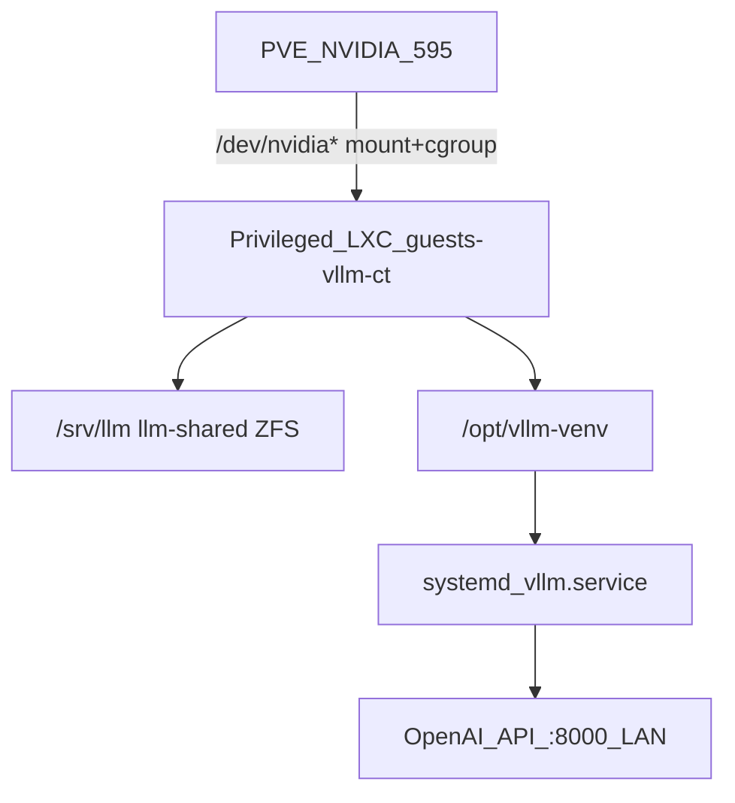

# Как мы подняли vLLM в LXC на Proxmox

*Инженерный дневник. Май 2026.*

**Предпосылка:** рабочий [Proxmox VE 9.1](01-proxmox-home-deploy.md) с **NVIDIA на хосте**, ZFS-пул **`netacA`**, мост **`vmbr0`**. Цель — **OpenAI-совместимый HTTP API** в домашней сети на **RTX 3060 12 GB**, без отдельной физической машины под инференс.

Стек: **privileged LXC** (Ubuntu 24.04), проброс **`/dev/nvidia*`**, **vLLM** в venv, **`systemd`**, порт **8000** только в LAN.

Пошаговые команды: [instruction.md](instruction.md) фазы 11–12.

### Состояние на 2026-05-26 (проверено по SSH)

| Параметр | Факт |
|----------|------|
| CT | `guests-vllm-ct`, **`10.x.x.101`**, `ssh guests-101` |
| ОС | Ubuntu 24.04 LTS |
| rootfs | ZFS `netacA/subvol-101-disk-0`, 64 GiB (~9 GiB занято) |
| Данные LLM | **`/srv/llm`** ← dataset **`netacA/llm-shared`** (~17 GiB моделей) |
| NVIDIA | **595.71.05** (как на хосте) |
| vLLM | **0.20.2**, `systemd` **active**, порт **8000**, сейчас модель **Qwen3-8B-AWQ** |
| GPU mutex | `hookscript: local:snippets/gpu-mutex.sh` |
| Модели в `models/` | Qwen3-8B-AWQ, Qwen2.5-7B-AWQ, Qwen3-1.7B, Qwen3-0.6B, Qwen2-0.5B-Instruct |

---

## Почему LXC, а не VM с passthrough

| Вариант | Плюсы | Минусы для нас |
|---------|--------|----------------|
| **LXC + GPU на хосте** | Один драйвер на PVE, проще обновлять, меньше overhead | Нужен **privileged** CT, ручной проброс устройств, совпадение user-space NVIDIA с хостом |
| **VFIO passthrough в VM** | Почти «голое железо» для игр | 3060 целиком у VM — **нет** LLM на хосте одновременно; сложнее эксплуатация |

Мы заложили игры в VM как **опциональную** ветку на ту же карту; для LLM выбрали **LXC `guests-vllm-ct` (VMID 101)**.



---

## Дизайн контейнера

Создавали через Web UI (`https://10.x.x.123:8006/`), затем правили конфиг.

| Параметр | Значение | Зачем |
|----------|----------|--------|
| **VMID** | 101 | |
| **Hostname** | `guests-vllm-ct` | |
| **Template** | Ubuntu 24.04 standard | Wheel’ы PyTorch/vLLM без сюрпризов Debian vs Ubuntu на хосте |
| **Privileged** | **да** (`unprivileged: 0`) | Проброс GPU и cgroup |
| **rootfs** | `netacA:64` | ОС, apt, venv, логи |
| **Данные LLM** | сначала отдельный том **`mp0`** на ZFS; **позже** — общий dataset **`netacA/llm-shared`** → **`/srv/llm`** в CT (bind с хоста `/mnt/llm-shared`) | Модели, HF-кэш; backup на тяжёлый том по политике |
| **CPU** | 8 cores | Препроцессинг и несколько клиентов; GPU — узкое место не всегда |
| **RAM** | 65536 MiB | Запас под offload/MoE-эксперименты; на хосте 96 GiB |
| **Swap** | 8192 MiB | Страховка от пиков, не «расширение VRAM» |
| **Сеть** | `vmbr0`, **`10.x.x.101/24`**, gw `10.x.x.1` | Прямой доступ из LAN |
| **Firewall (CT)** | выкл. на отладке | Включать позже с правилами под LAN |
| **Nesting** | `features: nesting=1` | WARN при systemd 255+; для vLLM не обязателен, но безвреден |

**Почему не `local-lvm` для rootfs:** на NVMe мало места (система PVE + `local-lvm`); тяжёлые данные и корень LLM-CT — на **ZFS**.

---

## Проброс GPU: устройства, cgroup, версии

### Что должно быть на хосте до старта CT

```bash
nvidia-smi          # драйвер и 3060
lsmod | grep nvidia # nvidia, nvidia_uvm, …
ls -l /dev/nvidia*  # в т.ч. nvidia-uvm
```

Сразу после создания CT **`/dev/nvidia-uvm` внутри не было** — для CUDA/vLLM он обязателен. На хосте модуль **`nvidia_uvm`** должен быть загружен.

### Актуальный `/etc/pve/lxc/101.conf` (боевой)

Сначала у CT был отдельный ZFS-том **`mp0`** (subvol на `netacA`); позже перешли на общий dataset **`/mnt/llm-shared`** → **`/srv/llm`** (§11.2a в [instruction.md](instruction.md)).

```text
arch: amd64
cores: 8
features: nesting=1
hookscript: local:snippets/gpu-mutex.sh
hostname: guests-vllm-ct
memory: 65536
mp0: /mnt/llm-shared,mp=/srv/llm
net0: name=eth0,bridge=vmbr0,gw=10.x.x.1,hwaddr=x:x:x:x:x:x,ip=10.x.x.101/24,type=veth
ostype: ubuntu
rootfs: netacA:subvol-101-disk-0,size=64G
swap: 8192
lxc.mount.entry: /dev/nvidia0 dev/nvidia0 none bind,optional,create=file
lxc.mount.entry: /dev/nvidiactl dev/nvidiactl none bind,optional,create=file
lxc.mount.entry: /dev/nvidia-modeset dev/nvidia-modeset none bind,optional,create=file
lxc.mount.entry: /dev/nvidia-uvm dev/nvidia-uvm none bind,optional,create=file
lxc.mount.entry: /dev/nvidia-uvm-tools dev/nvidia-uvm-tools none bind,optional,create=file
lxc.cgroup2.devices.allow: c 195:* rwm
lxc.cgroup2.devices.allow: c 507:* rwm
```

Скрипт hook лежит на хосте как **`/var/lib/vz/snippets/gpu-mutex.sh`** (копия из [`scripts/pve/gpu-mutex.sh`](scripts/pve/gpu-mutex.sh)); список VMID — в **`/etc/gpu-mutex/group.conf`** или **`/etc/pve/gpu-guests/group.conf`**.

Major **195** — `nvidia*`, **507** — `nvidia-uvm*`. На другой машине сверяйте: `ls -l /dev/nvidia*`.

После правок: **`pct stop 101`**, **`pct start 101`**.

### Сложности с версиями драйвера

Хост — **Debian 13 (trixie)**, CT — **Ubuntu 24.04**. Это самый долгий этап.

- **«Драйвер только внутри контейнера»** для LXC **не работает**: CT не управляет модулями ядра — стек NVIDIA должен быть на **хосте**, в CT — согласованный **user-space** и проброс **`/dev/nvidia*`**.
- Сразу после создания CT не было **`/dev/nvidia-uvm`** — без него CUDA/vLLM не стартуют; добавили mount + cgroup **507:***.
- При несовпадении версий — **`NVML: Driver/library version mismatch`**. Частая ловушка: обновили модуль на хосте, а в CT остались старые **`libnvidia-*`** (или наоборот). User-space в CT должен соответствовать **Driver Version** на хосте; тянуть «чужие» Ubuntu-пакеты с другой ветки CUDA опасно.
- При создании CT Proxmox предупредил: **`Systemd 255 detected. You may need to enable nesting`** — включили **`features: nesting=1`** (для vLLM не обязательно, но для systemd внутри CT полезно).

Итог (критерий «готово»):

```text
Driver Version: 595.71.05
CUDA Version: 13.2
```

— **одинаково** в `nvidia-smi` на хосте и в CT.

**Фиксация в CT:** `apt-mark hold` на все установленные `libnvidia-*` и `nvidia-*`. После reboot хоста: stop CT → reboot PVE → start CT → снова сверить версии.

---

## Mutex одной GPU (включён на CT 101)

На одной **3060** нельзя осмысленно крутить два тяжёлых инференса в разных гостях. На **101** в конфиге стоит:

```text
hookscript: local:snippets/gpu-mutex.sh
```

Hook [`scripts/pve/gpu-mutex.sh`](scripts/pve/gpu-mutex.sh) на **pre-start** не даёт поднять второй VMID из **`group.conf`**, если другой гость из списка уже **running**. Это **эксклюзивность гостя**, не лимит VRAM внутри одного `vllm.service`.

---

## vLLM: от venv до systemd

### Каталоги на `/srv/llm`

```bash
mkdir -p /srv/llm/models /srv/llm/hf/hub
```

| Путь | Назначение |
|------|------------|
| `/srv/llm/models/` | Явные копии весов для `vllm serve /path/...` |
| `/srv/llm/hf/` | `HF_HOME`, hub-кэш |

Переменные **не появляются сами** — задаём в `/etc/profile.d/vllm-hf.sh` (SSH) и `/etc/vllm/vllm.env` (systemd).

### Python и vLLM

```bash
apt update
apt install -y python3 python3-venv python3-pip build-essential git
python3 -m venv /opt/vllm-venv
/opt/vllm-venv/bin/pip install -U pip wheel
/opt/vllm-venv/bin/pip install vllm
```

Версии **torch/CUDA** смотрим по [документации vLLM](https://docs.vllm.ai/en/latest/getting_started/installation/gpu.html) под **драйвер 595.x** (в `nvidia-smi` часто **CUDA 13.2**).

### Hugging Face: `hf`, не `huggingface-cli`

```bash
/opt/vllm-venv/bin/pip install -U huggingface_hub
/opt/vllm-venv/bin/hf download Qwen/Qwen2-0.5B-Instruct \
  --local-dir /srv/llm/models/Qwen2-0.5B-Instruct
```

Старый **`huggingface-cli`** deprecated — используем **`hf`** из того же venv (`pip install -U huggingface_hub`).

### Первый smoke-тест

```bash
source /etc/profile.d/vllm-hf.sh
/opt/vllm-venv/bin/vllm serve /srv/llm/models/Qwen2-0.5B-Instruct \
  --host 0.0.0.0 --port 8000 \
  --max-model-len 4096 --gpu-memory-utilization 0.90 --max-num-seqs 4
```

С другого ПК в LAN:

```bash
curl -sS http://10.x.x.101:8000/v1/models | head
curl -sS http://10.x.x.101:8000/v1/chat/completions \
  -H 'Content-Type: application/json' \
  -d '{"model":"Qwen2-0.5B-Instruct","messages":[{"role":"user","content":"ping"}],"max_tokens":32}'
```

---

## Продакшен: `vllm.env` и systemd

Боевой файл в CT — **`/etc/vllm/vllm.env`** (копия в репо: [`scripts/ct/vllm.env.example`](scripts/ct/vllm.env.example)):

```bash
LISTEN_HOST=0.0.0.0
LISTEN_PORT=8000

MODEL_PATH=/srv/llm/models/Qwen3-8B-AWQ

MODEL_PATH_MEDIUM=/srv/llm/models/Qwen3-8B-AWQ
MODEL_PATH_SMALL=/srv/llm/models/Qwen3-1.7B
MODEL_PATH_FALLBACK=/srv/llm/models/Qwen2.5-7B-Instruct-AWQ
MODEL_PATH_TINY=/srv/llm/models/Qwen3-0.6B

HF_HOME=/srv/llm/hf
HF_HUB_CACHE=/srv/llm/hf/hub
TRANSFORMERS_CACHE=/srv/llm/hf/hub
HF_DATASETS_CACHE=/srv/llm/hf/datasets
```

Важно: **не** называть свои переменные с префиксом **`VLLM_`** — vLLM 0.20+ логирует `Unknown vLLM environment variable`. Используем **`LISTEN_HOST`**, **`LISTEN_PORT`**, **`MODEL_PATH`**, **`HF_HOME`**, …

`MODEL_PATH_*` без префикса `VLLM_` — для скриптов переключения модели; **одновременно** на одной 3060 всё равно только один активный `vllm.service`.

Боевой профиль под **3060 12 GB** и **2–5** параллельных клиентов:

```text
--max-model-len 8192
--gpu-memory-utilization 0.90
--max-num-seqs 5
```

Смена модели: правка **`MODEL_PATH`** в `/etc/vllm/vllm.env` → **`systemctl restart vllm`**. Два **`vllm serve`** на одной карте с `util=0.90` не планировали.

Полный unit и `EnvironmentFile=` — в [instruction.md](instruction.md) §12.3.

---

## Боевые модели и цифры

Скачали в `/srv/llm/models/` (через `hf download`):

- **Qwen3-8B-AWQ** — основная «средняя»
- **Qwen2.5-7B-Instruct-AWQ** — запасная
- **Qwen3-1.7B**, **Qwen3-0.6B** — быстрые / лёгкие

Замеры при общих флагах сервиса (май 2026, [vllm_serve_first_data.md](vllm_serve_first_data.md)):

| Модель | Веса на GPU (лог) | KV cache (лог) | nvidia-smi | Пик gen (лог) |
|--------|-------------------|----------------|------------|---------------|
| Qwen3-0.6B | 1.12 GiB | 8.93 GiB | 10687 / 12288 MiB | ~54 tok/s |
| Qwen3-1.7B | 3.22 GiB | 6.54 GiB | 10449 / 12288 MiB | **~82 tok/s** |
| Qwen2.5-7B-AWQ | 5.20 GiB | 4.12 GiB | 9987 / 12288 MiB | ~50 tok/s |
| Qwen3-8B-AWQ | 5.71 GiB | 3.47 GiB | 9727 / 12288 MiB | ~57 tok/s |

### Как читать `nvidia-smi` с vLLM

При **`--gpu-memory-utilization 0.90`** занятость в **`nvidia-smi`** (~9.7–10.7 GiB) **почти не зависит** от размера модели: vLLM резервирует **~90%** карты под пул (веса + KV + служебное). Меньшая модель получает **больший KV**, а не «пустую» VRAM в smi.

Сравнивать модели по логам:

- **`Model loading took X GiB`**
- **`Available KV cache memory`**

При одном коротком запросе **KV usage** в логах низкий — узкое место при нескольких длинных сессиях именно **KV**, не веса.

Первый «живой» запрос с ноутбука: *«как собрать электрогенератор самому»* — проверка end-to-end без бенчмарка.

---

## Нагрузочный тест (`vllm bench serve`)

Скрипт [`scripts/ct/bench-vllm-serve.sh`](scripts/ct/bench-vllm-serve.sh), результаты — [vllm_bench_serve.md](vllm_bench_serve.md), модель **Qwen3-8B-AWQ**, те же флаги сервиса.

| Профиль | Суть | Итог (кратко) |
|---------|------|----------------|
| **smoke** | 20 запросов, concurrency 1 | ~51 tok/s output, p99 TTFT ~378 ms, 0 failed |
| **load** | 50 запросов, concurrency 5, 2 RPS | ~158 tok/s output, p99 TTFT ~1.27 s, 0 failed |

Это **throughput/latency** поднятого сервиса, не оценка «умности» модели.

---

## Эксплуатация

**Безопасность (Starlette):** на CT 101 установлен **`starlette==1.0.1`** (CVE-2026-48710). Процедура и проверки — [update-starlette-cve-2026-48710.md](update-starlette-cve-2026-48710.md); пины — [`scripts/ct/vllm-venv-pins.txt`](scripts/ct/vllm-venv-pins.txt).

Доступ: **`ssh guests-101`** (порт 1234, user `guests`). Файлы в `/etc/vllm/` и unit vLLM правит **root** (`sudo`).

| Задача | Действие |
|--------|----------|
| Логи | `journalctl -u vllm.service -f` |
| GPU | `nvidia-smi` (в LXC блок Processes может быть пуст при ненулевой Memory-Usage) |
| Смена модели | `MODEL_PATH` в `vllm.env` → `systemctl restart vllm` |
| OOM / не хватает VRAM | сначала уменьшить **`--max-model-len`**, потом `max-num-seqs` |
| Доступ | `0.0.0.0:8000` — только LAN; не пробрасывать порт на роутер без необходимости |
| Бэкап | rootfs CT — да; **mp0 с моделями** — нет (веса восстанавливаем `hf download`/rsync) |

**VFIO vs LLM:** пока 3060 в passthrough-VM, этот CT с vLLM на хостовом драйвере **не работает** на той же карте — нужен другой режим или LLM внутри той VM.

---

## Уроки (коротко)

1. **Privileged LXC + bind mount** — рабочий домашний путь к GPU без VFIO.
2. **`nvidia-uvm`** и **cgroup 507:** — проверять явно, не только `nvidia0`.
3. **Версия драйвера в CT = версия на хосте** — иначе долгая отладка; **`apt-mark hold`** в CT.
4. **`HF_HOME` на отдельном томе** — rootfs 64 GiB не забивается wheel’ами и кэшем.
5. **`nvidia-smi` обманывает** при сравнении моделей — смотреть логи vLLM.
6. **Один тяжёлый инференс на 3060** — планировать mutex и один `vllm.service`.
7. В LXC **`nvidia-smi`** может показывать **пустой Processes** при ненулевой **Memory-Usage** — ориентир: MiB + `journalctl -u vllm`.
8. **Qwen3** в API иногда отдаёт блок «thinking» в chat template — для обычного чата настраивать шаблон/флаги отдельно.

---

## Ссылки в этой папке

- [01 — Proxmox дома](01-proxmox-home-deploy.md)
- [instruction.md](instruction.md) §11–12
- [vllm_serve_first_data.md](vllm_serve_first_data.md), [vllm_bench_serve.md](vllm_bench_serve.md)
- [README.md](README.md) — оглавление
