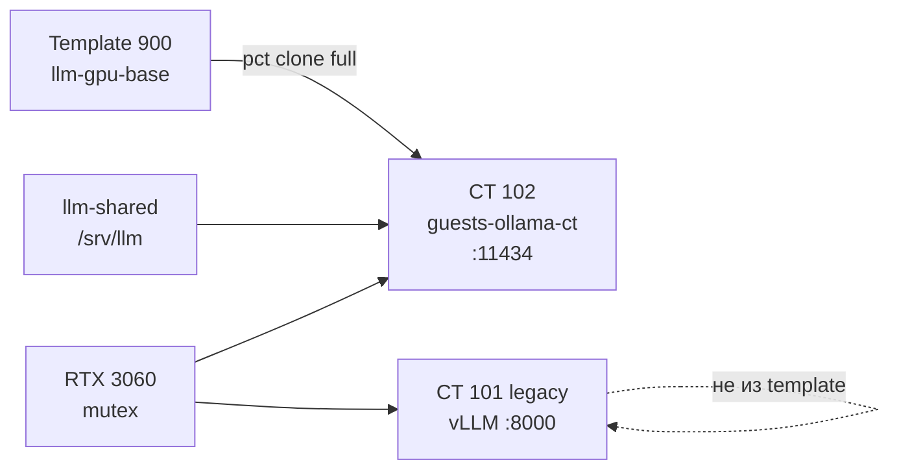

# Ollama в CT 102 из template 900

*Инженерный дневник. Май 2026.*

**Предпосылка:** готовый [LLM-GPU base template (900)](03-llm-gpu-base-template.md) — Ubuntu 24.04, NVIDIA user-space, `/srv/llm`, GPU mutex, **без** движка. Legacy **CT 101** — vLLM. Цель — второй движок (**Ollama**) на той же **RTX 3060**, по очереди с vLLM.

Пошаговый runbook: [03c — deploy clone](03c-deploy-llm-gpu-clone.md). Один скрипт: [`deploy-llm-ct.sh`](scripts/pve/deploy-llm-ct.sh).

---

## Зачем template, а не копия 101

| Подход | Проблема |
|--------|----------|
| Clone **101** (vLLM) | В rootfs копируется весь vLLM venv — «вырезать» нельзя |
| Template **900** без движка | Clone получает только общий слой; Ollama — отдельный шаг |

---

## Схема



| VMID | Роль | Модели |
|------|------|--------|
| **900** | Template (stopped) | — |
| **101** | vLLM | `/srv/llm/models/` (HF) |
| **102** | Ollama | `/srv/llm/ollama/` (blobs) |

Форматы **не смешиваем**: HF-веса для vLLM, Ollama blobs — отдельный каталог на shared ZFS.

---

## Развёртывание одним проходом

На PVE под root (`~/llm-gpu-setup`, `pve-deploy.env`):

```bash
bash RUN_AS_ROOT.sh ollama
# пересоздание для проверки runbook:
DESTROY_YES=1 bash scripts/pve/deploy-llm-ct.sh --engine ollama
```

Ожидание (~10–15 мин): full clone ~1.5 GiB → `zstd` + Ollama install → `systemctl active` → `curl http://10.x.x.102:11434/` → «Ollama is running».

---

## Уроки первого прогона (чеклист)

| Симптом | Причина | Fix в скрипте |
|---------|---------|---------------|
| `install.sh`: needs **zstd** | Пакет не в template | `apt install zstd` перед install |
| `ollama.service` crash-loop | `OLLAMA_MODELS=/srv/llm/ollama` owned **root**, service runs as **ollama** | `chown ollama:ollama` |
| `curl` с LAN: refused | `OLLAMA_HOST=0.0.0.0` без порта — Ollama слушает 127.0.0.1 | override **`0.0.0.0:11434`** + `systemctl restart` |
| SSH: Permission denied | Ключ на хосте ≠ в CT | `pct push` authorized_keys после clone |
| `su -` / `sudo` не работают | Пароли не заданы в template | `pct exec 102 -- passwd …` (см. 03c) |

Все пункты встроены в **`deploy-llm-ct.sh`** + [`install-ollama-engine.sh`](scripts/pve/install-ollama-engine.sh). В template bootstrap добавлен пакет **`zstd`** на следующую пересборку 900.

---

## Эксплуатация

**Переключение GPU** (mutex):

```bash
pct stop 101 && pct start 102    # Ollama
pct stop 102 && pct start 101    # vLLM
```

**Проверки:**

```bash
curl -s http://10.x.x.102:11434/
ssh guests-102 'nvidia-smi | head -3; systemctl is-active ollama'
pct exec 102 -- ollama run qwen2.5:0.5b 'ping'
```

**Registry:** `/etc/llm-gpu/clones.registry` — строка `102 guests-ollama-ct ollama 900 …`.

---

## Что дальше

- Новый движок (103+): [03c](03c-deploy-llm-gpu-clone.md) с `--engine none`.
- Обновление драйвера: [03b](03b-upgrade-nvidia-driver-chain.md).
- Изменение GPU/mp0 на всех clone: [03a](03a-propagate-conf-from-template.md).

---

## Проверка модели (2026-05-30)

После deploy:

```bash
ollama pull qwen3:8b    # ~5.2 GB → /srv/llm/ollama/
ollama list
```

API с LAN (аналог vLLM **Qwen3-8B-AWQ**):

```bash
curl -s http://10.x.x.102:11434/api/generate -d '{
  "model": "qwen3:8b", "prompt": "ping", "stream": false
}'
```

Факт: VRAM **~5533 MiB / 12288**, GPU-Util **~96%** под генерацией.

Подробнее: [05 — Ollama operations](05-ollama-operations.md), [06 — inference settings](06-ollama-inference-settings.md).
